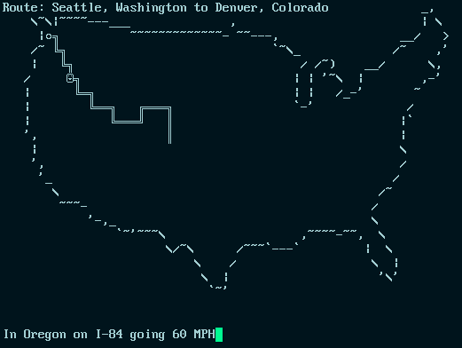

```text
    __ __              ______     
   '  )  )           /   /        
     /--' __ __.  __/ --/__  o _  
    /  \_(_)(_/|_(_/_(_// (_<_/_)_
                             /    
                          __/     
```
# Roadtrip

Take a RoadTrip cross country with your friends... in your terminal!




RoadTrip is a low intensity casual multiplayer background game requiring little interaction and can be played at your own pace while working or doing other activities.

## Current State

What comes before Alpha? Currently you can run the server and client and create a car which will travel from Seattle to Denver. No fancy features exist yet.

## Design


RoadTrip is a client server application with the following components:

**GameClient** - Terminal application written in Go. Talks GraphQL to the API server. Displays the text UI.

**API Server** - GraphQL server written in typescript, apollo, prisma. Delegates some queries to the GameServer using gRPC.

**GameServer** - Go gRPC microservice to update live world data. Periodically persists state to postgres db via prisma.

**Database** - Postgres

The client is written in Go for cross-platform support. The API server is written in node/typescript with a postgres database and prisma. The server parts are built to run in containers using either Kubernetes or Docker Compose.
